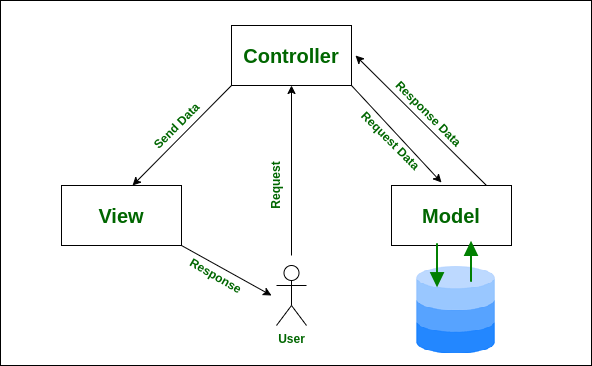
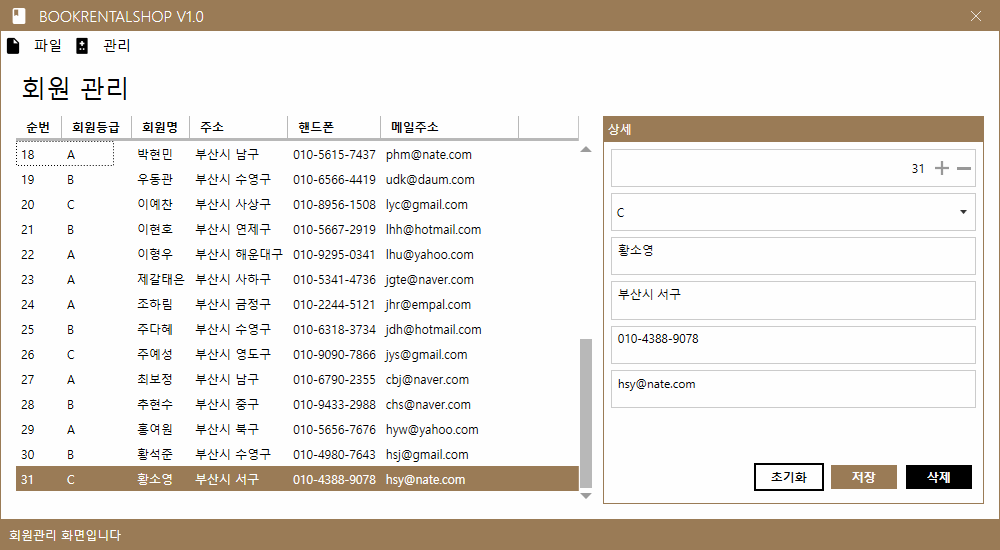
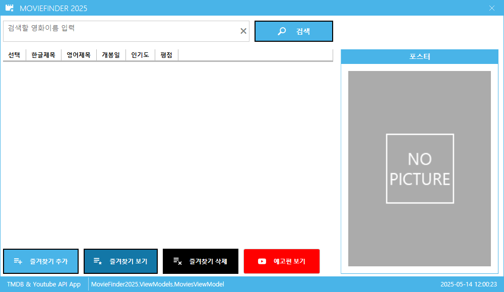

# iot-wpf-2025
IoT 개발자 WPF 학습리포지토리 2025

## 1일차

### WPF 개요
- Windows Presentaion Foundation
    - WinForms의 디자인의 미약한 부분, 속도개선, `개발과 디자인의 분리` 개선하고자 MS 프레임워크
    - 화면디자인을 XML기반의 xaml 
    
### WPF DB바인딩 연습
1. 프로젝트 생성 - [디자인](./day01/Day01Wpf/WpfBasicApp01/MainWindow.xaml), [소스](./day01/Day01Wpf/WpfBasicApp01/MainWindow.xaml.cs)
2. NuGet패키지에서 `MahApps.Metro`(디자인) 라이브러리 설치
3. 디자인 영역
    - App.xaml
    - MainWindow.xaml
    - MainWindow.xaml.cs의 기반클래스를 변경하는 것 - 디자인
4. UI구현
5. DB연결 사전준비
    - NuGet패키지에서 `MySQL.Data` 라이브러리 설치
6. DB연결
    1. DB연결문자열(ConnectionString) : DB종류마다 연결문자열 포맷이 다르고 무조건 있어야함
    2. 쿼리(옵션) : 실행할 쿼리(보통 SELECT, INSERT, UPDATE, DELETE)
    3. 데이터를 담을 객체 : 리스트 형식
    4. DB연결객체(`SqlConnection`) : 연결문자열을 처리하는 객체. DB연결, 끊기, 연결확인...
        - DB종류별로 MySqlConnection, SqlConnection, OracleConnection...
    5. DB명령객체(`SqlCommand`) : 쿼리를 컨트롤하는 객체, 생성시 쿼리와 연결객체
        - ExecuteReader() : SELECT문 실행, 결과 데이터를 담는 메서드
        - ExecuteScalar() : SELECT문 중 count() 등 함수로 1row/1column 데이터만 가져오는 메서드
        - ExecuteNonQuery() : INESRT, UPDATE, DELETE문과 같이 transaction이 발생하는 쿼리실행 사용 메서드
    6. DB데이터어댑터(`SqlDataAdapter`) : 연결이후 데이터처리를 쉽게 도와주는 객체
        - DB명령객체처럼 쿼리를 직접실행할 필요없음
        - DataTable, DataSet객체에 fill() 메서드로 자동으로 채워줌
        - 거의 SELECT문에만 사용
    7. DB데이터리더(`SqlDataReader`)
        - DataReader : ExecuteReader()로 가져온 데이터를 조작하는 객체
        - DataAdapter : 좀더 간단하게 데이터를 처리해주는 객체

7. 실행결과

    


8. MahApps.Metro 방식 다이얼로그 처리

    

9. `전통적인 C# 윈앱개발`과 차이가 없음

### WPF MVVM
- [디자인패턴](https://ko.wikipedia.org/wiki/%EC%86%8C%ED%94%84%ED%8A%B8%EC%9B%A8%EC%96%B4_%EB%94%94%EC%9E%90%EC%9D%B8_%ED%8C%A8%ED%84%B4)
    - 소프트웨어 공학에서 공통적으로 발생하는 문제를 재사용 가능하게 해결한 방식들
    - 반복적으로 되풀이되는 개발디자인의 문제를 해결하도록 맞춤화시킨 양식(템플릿)
    - 여러 디자인패턴 중 아키텍쳐패턴, 그 중 디자인과 개발을 분리해 개발할 수 있는 패턴을 준비
        - MV* : MVC, MVP, MVVM...

- MVC : Model-View-Controller 패턴
    - 사용자 인터페이스(View)와 비즈니스 로직(Controller, Model)분리해서 앱을 개발
    - 디자이너에게 최소한의 개발에 참여를 시킴
    - 개발자는 디자인은 고려하지 않고 개발만 할 수 있음
    - 사용자는 Controller에게 요청
    - Controller가 Model에게 Data를 요청
    - Model이 DB에 데이터를 가져와 Controller로 전달
    - Controller는 데이터를 비즈니스로직에 따라서 처리하고 View로 전달
    - View는 데이터를 화면에 뿌려주고, 화면상에 처리할 것을 마친 후 사용자에게 응답

    - 구조는 복잡, 각 부분별 개발코드는 간결
    - Spring Boot, `ASP.NET`, jDango 등 웹개발 아키텍처패턴으로 표준으로 사용

    

- MVP : Model-View-Presenter 패턴
    - MVC 패턴에서 파생됨
    - Presenter : Supervising Controller라고 부름

- **MVVM** : Model-View-ViewModel 패턴
    - MVC 패턴에서 파생
    - 마크업언어로 GUI코드를 구현하는 아키텍처
    - 사용자는 View로 접근(MVC와 차이점)
    - ViewModel이 Controller 역할(비즈니스로직 처리)
    - Model은 당연히 DB요청, 응답
    - 연결방식이 MVC와 다름
    - 전통적인 C#방식은 사용자가 이벤트발생시키기 때문에 발생시기를 바로 알 수 있음
    - MVVM 방식은 C#이 변화를 주시하고 있어야 함. 상태가 바뀌면 변화를 줘야함

    

- MVVM 장단점
    - View <-> ViewModel간 데이터 자동 연동
    - 로직 분리로 구조가 명확해짐. 자기할일만 하면 됨
    - 팀으로 개발시 역할분담이 확실. 팀프로젝트에 알맞음
    - 테스트와 유지보수는 쉬움
    - 구조가 복잡. 디버깅이 어려움
    - 스케일이 커짐


### WPF MVVM 연습
1. 프로젝트 생성 - [디자인](./day01/Day01Wpf/WpfBasicApp02/View/MainWindow.xaml), [소스](./day01/Day01Wpf/WpfBasicApp02/ViewModel/MainViewModel.cs)
2. WPF DB바인딩 연습시 사용한 UI 그대로 복사
3. Model, View, ViewModel 폴더 생성
4. MainWindow.xaml을 View로 이동
5. App.xaml StartupUri 수정
6. Model폴더 내 Book클래스 생성
    - INotifyPropertyChanged 인터페이스 : 객체내의 어떠한 속성값이 변경되면 상태를 C#에게 알려주는 기능
    - PropertyChangedEventHandler 이벤트 생성 
7. ViewModel폴더 내 MainViewModel클래스 생성
    - INotifyPropertyChanged 인터페이스 구현
    - OnPropertyChanged 이벤트핸들러 메서드 코딩
8. MainView.xaml에 ViewModel 연결
    ```xml
        ...
        xmlns:vm="clr-namespace:WpfBasicApp02.ViewModel"
        DataContext="{DynamicResource MainVM}">
        ...    
    <mah:MetroWindow.Resources>
        <!-- MainViewModel을 가져와서 사용하겠다!! -->
        <vm:MainViewModel x:Key="MainVM" />
    </mah:MetroWindow.Resources>
    ```
9. MainView.xaml 컨트롤에 바인딩 작업
    - 전통적인 C# 방식 : x:Name사용(비하인드 사용필요), 마우스이벤트 추가

    ```xml
    <!-- UI 컨트롤 구성 -->
    <DataGrid x:Name="GrdBooks" 
            Grid.Row="0" Grid.Column="0" Margin="5" 
            AutoGenerateColumns="False" IsReadOnly="True" 
            MouseDoubleClick="GrdBooks_MouseDoubleClick">
        <DataGrid.Columns>
            <DataGridTextColumn Binding="{Binding Idx}" Header="순번" />
    ```

    - WPF MVVM 바인딩 방식 : 전부 Binding 사용

    ```xml
    <!-- UI 컨트롤 구성 -->
    <DataGrid Grid.Row="0" Grid.Column="0" Margin="5" 
            AutoGenerateColumns="False" IsReadOnly="True"
            ItemsSource="{Binding Books}"
            SelectedItem="{Binding SelectedBook, Mode=TwoWay}">
        <DataGrid.Columns>
            <DataGridTextColumn Binding="{Binding Idx}" Header="순번" />
    ```
10. 실행결과

    

## 2일차

### MVVM Framework
- MVVM 개발자체가 어려움. 초기 개발시 MVVM 템플릿을 만드는데 시간이 많이 소요. 난이도 있음
- 조금 쉽게 개발하고자 3rd Party에서 개발한 MVVM 프레임워크 사용
- 종류
    - `Prism` : MS계열에서 직접 개발. 대규모 앱 개발시 사용. 모듈화잘되어 있음. 커뮤니티 활발
        - 진입장벽 높음
    - `Caliburn.Micro` : 경량화된 프레임워크. 쉽게 개발할 수 있음. Xaml 바인딩 생략가능. 커뮤니티 주는추세
        - [공식사이트](https://caliburnmicro.com/)
        - [Github](https://github.com/Caliburn-Micro/Caliburn.Micro)
        - MahApps.Metro에서 사용 중
        - 디버깅이 어려움
        - [문제]MahApps.Metro의 메시지박스 다이얼로그가 구현이 안됨!!
        
    - `MVVM Light Toolkit` : 가장 가벼운 MVVM 입문용. 쉬운 Command 지원. 개발종료.
        - 확장성이 떨어짐
    - **CommunityTooklit.Mvvm** : MS 공식 경량MVVM. 단순,빠름. 커뮤니티등 매우 활발
        - NotifyPropertyChanged를 사용할 필요없음
        - 모듈기능이 없음        

    - `ReactiveUI` : 최신기술 Rx기반 MVVM. 비동기,스트림처리 강력. 커뮤니티가 활발.
        - 진입장벽이 높음

### Caliburn.Micro 학습
1. WPF 프로젝트 생성
2. NuGet 패키지 Caliburn.Micro 검색 후 설치
3. App.xaml StartupUri를 삭제 - [소스](./day02/Day02Wpf/WpfBasicApp01/App.xaml)
4. Models, Views, ViewModels 폴더(이름이 똑같아야 함) 생성
5. MainViewModel 클래스 생성 - [소스](./day02/Day02Wpf/WpfBasicApp01/ViewModels/MainViewModel.cs)
    - MainView의 속하는 ViewModel은 반드시 MainViewModel라는 이름을 써야함
6. MainWindow.xaml을 View 이동
7. MainWindow를 MainView로 이름 변경
8. Bootstrapper 클래스 생성, 작성 - [소스](./day02/Day02Wpf/WpfBasicApp01/Bootstrapper.cs)
9. App.xaml에서 Resource 추가
10. MahApps.Metro UI 적용

    

### Caliburn.Micro MVVM 연습 
1. WPF 프로젝트 생성 - [소스](./day02/Day02Wpf/WpfBasicApp02/ViewModels/MainViewModel.cs)
2. 필요 라이브러리 설치
    - Caliburn.Micro
    - MahApps.Metro
    - MahApps.Metro.IconPacks
    - MySQL.Data
3. Models, Views, ViewModels로 폴더 생성
4. 이전작업 소스코드 복사, 네임스페이스 변경

    

## 3일차 (05.12)

### CommunityToolkit.Mvmm 다시
1. Wpf프로젝트 생성
2. 필요 라이브러리 설치
    - CommunityToolkit.Mvvm
    - MahApps.Metro
    - MahApps.Metro.IconPacks
3. Models, Views, ViewModels 폴더 생성
4. MainWindow.xaml 삭제
5. App.xaml StartupUri 도 삭제
6. Views/MainView.xaml 생성
7. ViewModels/MainViewModel.cs 생성
8. App.xaml Startup 이벤트 추가
    - App.xaml.cs 로직 추가
9. App.xaml MahApps.Metro 관련 리소스 추가
10. MainView에 MetroWindow로 변경

    

### Log 라이브러리
- 개발한 앱, 솔루션의 현재상태를 계속 모니터링하는 기능
- Log 사용법
    - 직접 코딩 방식
    - 로그 라이브러리 사용방식
- Log 라이브러리
    - **NLog** : 가볍고 쉽다. 빠름. 데스크톱
    - Serilog : 어려운 편, 빠름. 웹쪽
    - Log4net : Java의 로그를 .NET으로 이전. 느림. 웹쪽
    - `ZLogger` : 제일 최신(2021), 초고속. 게임서버

### NLog 라이브러리 사용
1. NuGet패키지 > NLog, NLog.Schema 설치
2. 새항목 > XML파일 > NLog.config 생성
3. Info < `Debug` < Warn < Error < Fatal
4. `NLog.config`를 출력 디렉토리로 복사
5. Debug, Trace는 출력이 안됨
6. Info, Warn, Error, Fatal 을 사용

    

### DB연결 CRUD 연습
1. WPF프로젝트 생성
2. NuGet 패키지 필요라이브러리 설치
    - CommunityToolkit.Mvvm
    - MahApps.Metro / MahApps.Metro.IconPacks
    - MySql.Data
    - NLog
3. Models, Views, ViewModels 생성
4. App.xaml 초기화 작업
5. MainView.xaml, MainViewModel 메인화면 MVVM 작업
    - 메뉴작업
    - ContentControl 추가
6. 하위 사용자컨트롤 작업
    - BookGenre(View, ViewModel)
    - Books(View, ViewModel)
7. Models > Genre(DivisionTbl) 모델 작업
8. BookGenreViewModel DB처리 구현

    https://github.com/user-attachments/assets/f74861e5-afb1-4d21-ae14-855b08d41608


## 4일차

### DB연결 CRUD 연습(계속)
1. BookGenre에서 INSERT, UPDATE 기능 구현
2. NLog.config 생성
3. Helpers.Common 클래스 생성
    - NLog 인스턴스 생성
    - 공통 DB연결문자열 생성
    - MahApps.Metro 다이얼로그 코디네이터 생성
4. 각 ViewModel에 IDialogCoordinator 관련 코딩 추가
    - ViewModel 생성자에 파라미터 추가
    - View, ViewModel 연동시 IDialogCoordinator 연결
5. View에 Dialog관련 네임스페이스, 속성 추가
6. await this.dialogCoordinator.ShowMessageAsync() 사용

    

7. BookView.xaml 화면작업
8. MemberView.xaml, RentalView.xaml 화면작업
9. ViewModel들 작업

    

    

#### DB연결 CRUD 연습시 추가 필요사항
- [x] 여러번 나오는 로직 메서드화
- [x] NLog로 각 기능 동작시 로그남기기. 공통화작업
- [x] 연결문자열 Common으로 이전
- [x] 종료 메뉴 다이얼로그 MetroUI로 변경
- [x] MahApps.Metro 메시지형태로 변경
- [x] 삭제여부 메시지박스 추가

### DB연결 CRUD 실습
- BooksView, BooksViewModel 작업 실습
- 1일차 MVVM 내용, 오늘 학습한것 

## 5일차

### MovieFinder 2025
- 전체 UI : UI설계화면 다섯영역으로 구분

    

- 영화즐겨찾기앱
    - TMDB 사이트에서 제공하는 OpenAPI로 데이터 가져오기
    - 내가 좋아하는 영화리스트 선택, 즐겨찾기 저장
    - 저장한 영화만 리스트업, 삭제 가능
    - 선택된 영화 더블클릭 > 영화 상세정보 팝업
    - 선택된 영화 선택 > 예고편보기 > 유튜브동영상 팝업

- API / OpenAPI
    - Applicaiton Programming Interface
    - 개발자가 직접개발하지 않고 제3자가 만들어서 제공하는 서비스

- TMDB, Youtube
    - [TMDB](https://www.themoviedb.org/) API 신청
    - [Youtube Data API](https://console.cloud.google.com/) 신청    
        - 프로젝트 생성 후 API 및 서비스 > 라이브러리
        - Youtube Data API v3 선택
        - 사용버튼 클릭 
        - 사용자 인증정보 입력

### 프로젝트 시작
1. WPF 프로젝트 생성
2. NuGet 패키지 사용할 기본 라이브러리 설치
    - CommunityToolkit.Mvvm
    - MahApps.Metro / MahApps.Metro.IconPacks
    - MySql.Data
    - NLog
3. 폴더생성 : Helpers, Models, Views, ViewModels
4. MVVM 구조 초기작업
5. UI 구현

    

6. 로직구현
    1. TMDB API 사용 구현
    2. 관련 기능 전부구현
7. 데이터그리드 더블클릭해서 상세정보 표시
    - NuGet 패키지에서 Microsoft.Xaml.Behaviors.Wpf 설치
8. 텍스트박스에서 엔터시 이벤트 발생 처리
9. 텍스트박스 한글 입력 우선 처리
10. 실행시 텍스트박스에 포커스 가도록 처리

    https://github.com/user-attachments/assets/c118f2e9-882d-4d66-8085-71e3a221ff9a

## 6일차

### MovieFinder 2025 (계속)
1. 상태표시줄 시계 동작
2. 상태표시줄 검색결과 건수 표시
3. 로그 출력 정리
4. 즐겨찾기 DB연동...
    1. MySQL Workbench에서 moviefinder 데이터베이스(스키마) 생성
    2. movieitems 테이블생성. 컬럼은 MovieItem.cs 속성과 동일
    3. INSERT, UPDATE, DELETE 작업 

    

5. Youtube 예고편 보기
    1. TrailerView, TrailerViewModel
    2. WPF 기본 WebBrowser는 HTML5 기술이 표현안됨. 오류가 많음
    3. NuGet 패키지 - CefSharp.Wpf.NETCore WebBrowser패키지 설치
    4. CefSharp.Wpf 설치 시 프로젝트 속성>빌드>일반, 플랫폼 대상을 Any CPU에서 x64로 변경!!
    5. NuGet 패키지 - Google.Apis.YouTube.v3 설치

6. 기타 작업 완료
7. 결과 화면

    https://github.com/user-attachments/assets/9ba64ceb-5fc2-4ec3-9330-ff8a47cda6f9
    

## 7일차
### 부산광역시 부산맛집 정보앱
1. [데이터포털](https://data.go.kr) OpenAPI 신청

    

2. WPF 프로젝트 생성
3. NuGet 패키지 라이브러리 설치
    - CommunityToolkit.Mvvm
    - MahApps.Metro / MahApps.Metro.IconPacks
    - Newtonsoft.Json
    - CefSharp.Wpf.NETCore (플랫폼 x64로 변경!)
    - NLog 

3. MVVM 초기화
4. UI 디자인 및 구현

    https://github.com/user-attachments/assets/afbb89f4-659a-4d92-8565-0a78d8dde575


## 8일차 (05.19.)

### 부산광역시 부산맛집 정보앱 (계속)
1. 그리드 표현 아이템 조정
2. 메인창내용을 구글맵창으로 이동
3. CefSharp.Wpf로 구글맵지도 표현
4. 위도(Latitude), 경도(Longitude) 표현

    https://github.com/user-attachments/assets/2c64ccf1-a17a-424a-80b8-d14986211e4a


### 스마트홈 연동 모니터링앱


- 전면부


- 후면부

- [개발링크](https://github.com/hugoMGSung/hungout-with-arduino/tree/main/SmartHomeDIY)

1. Arduino + Raspberry Pi 스마트홈 기제작

#### MQTT


- Message Queueing Telemetry Transport : 기계간 통신용 경량 메시징 프로토콜
- Publish / Subscribe 라는 출판쪽 용어로 사용
    - Publish(출간) : 메시지 만들어서 전달
    - Subscribe(구독) : 필요한 메시지를 수신받아서 사용
- Server(MQTT 브로커)/Client 프로그램으로 동작
- 데이터는 휘발성 : 받는 사람이 없으면 데이터는 사라짐. DB에 저장하는 구성을 해줘야 함

- MQTT를 대체할 수 있는 유사한 기능을 하는 기술
    - `Redis`, `Apache Kafka`, *RabbitMQ*, ZeroMQ, Socket통신 직접개발

#### MQTT 시뮬레이션 프로젝트 시작
1. MQTT 브로커 설치
    - https://mosquitto.org/
    - mosquitto-2.0.21a-install-windows-x64.exe 설치
    - 설치 후 서비스에서 서비스 중지
2. Mosquitto 설정파일 수정
    - mosquitto.conf 문서에디터 관리자모드로 오픈
    - #listener -> listener 1883 으로 변경
    - #allow_anonymous false -> allow_anonymous true
    - 파일 저장 후, 서비스 재시작
3. Windows 보안
    - 방화벽 및 네트워크 보호 > 고급 설정
    - 인바운드 규칙 > 새 규칙
    - 포트 선택 > 다음
    - TCP 선택, 특정포트 1883 입력
4. MQTT Explorer 설치
    - new Connection 생성, Host 127.0.0.1, Port 1883 저장
    - CONNECT
5. VS Code에서 [MqttPub.py](./day08/Pythons/MqttPub.py) 파일 생성

    https://github.com/user-attachments/assets/a3494d2f-64bc-468f-8e9c-e4efbe60316e

### 스마트홈 프로젝트 시작
1. 화면 UI 변경
2. NuGet 패키지
    - CommunityToolkit.Mvvm 설치
3. Models, Views, ViewModels 폴더 생성
4. MainWindow 바인딩 처리
5. MainViewModel에서 바인딩 속성 초기화

    
    
    
## 9일차 

### 스마트홈 연동 모니터링앱 (계속)

#### MQTT 시뮬레이션 (계속)
